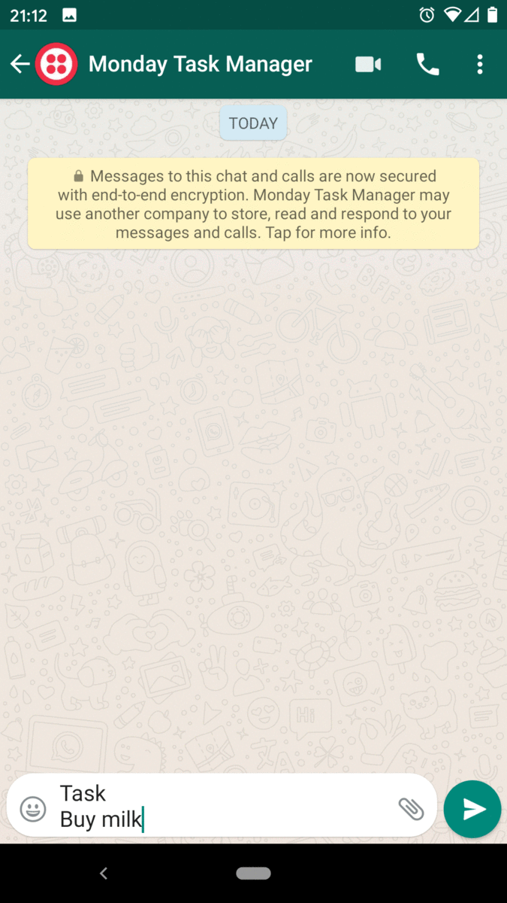

# [Monday](https://monday.com) Whatsapp Task Manager [](https://travis-ci.org/bolshchikov/monday-whatsapp-tasks)

## Motivation
Managing tasks in Monday is great. However, their mobile app is quite cumbersome. Especially, if you are on the go/meeting or in any other context, you don't have time to find the correct board and fill the item. <br>
Whatsapp is a convenient conversational interface that can help to solve this issue. <br>
Simply text your task to number, bot will add it to the relevant board. <br>
Later on you can edit, fill description, owner and prioritize it whenever there's time for that.



## Supported Functionality

### Identify current phone number with Monday user by email
Associate your phone number with your user in Monday. Doing this allows you to assign tasks to your Monday user. Send a message in the following format:
```
Email
<Enter your Monday email address>
```

### Create New Task
Create a new task by sending a message in the following format:
```
Task
<My task name>
<Board Name>
[Group Id]
```

### List tasks assigned to me
Returns the list of all tasks assigned to you with unassigned status.
```
Tasks
```
### List tasks assigned to me for today
Returns the list of all tasks assigned to you with unassigned status where the deadline is today's date.
```
Tasks today
```
## LICENSE
[MIT](/LICENSE).